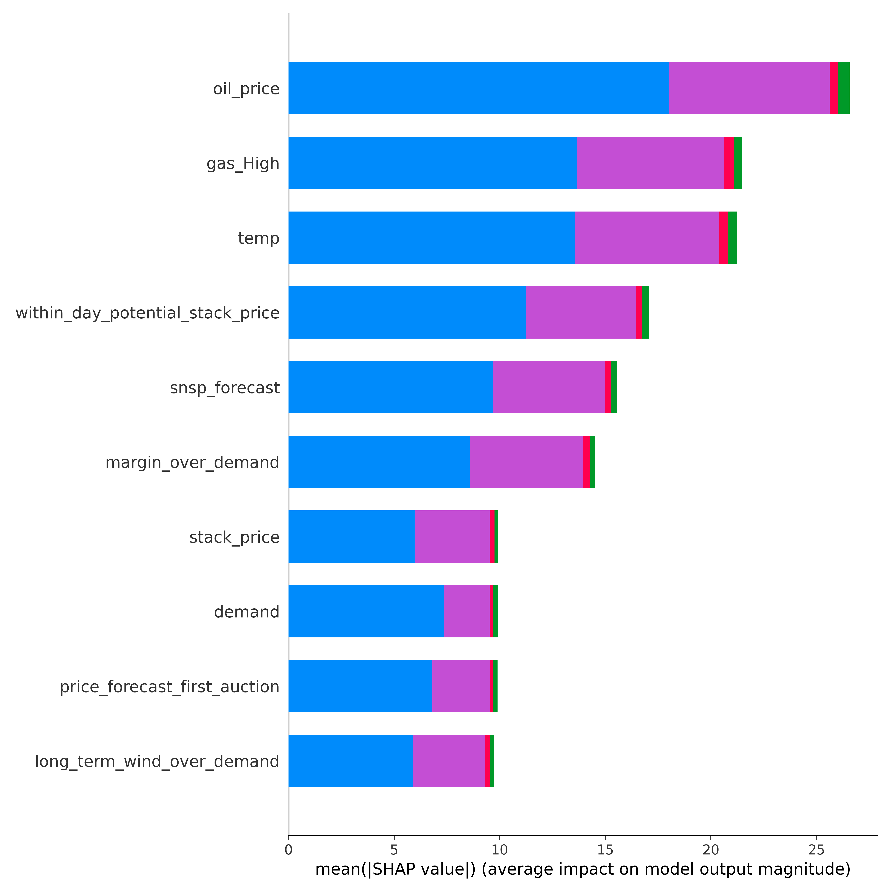

[](http://quantlet.de/)

## [](http://quantlet.de/) **MPF-Electricity_Distribution** [](http://quantlet.de/)

```yaml

Name of Quantlet:    'MPF-Electricity_Distribution'

Published in:        'Multivariate probabilistic forecasting of electricity prices with trading applications'

Description:         'This Quantlet contains training, visualisation and performance evaluation for 3 benchamrk models for electricity prices forecasting described in the manuscript:  distributional multilayer perceptron (DMLP) with fully connected architecture and a LSTM architecture, as well as simpe fit. '

Keywords:            'neural network,  electricity, JohnsonSU, distributional multilayer perceptron, DMLP, LSTM, forecast, shapley value,  Continuous Ranked Probability Score, CRPS'

Author:              Ilyas Agakishiev, Karel Kozmík


```


