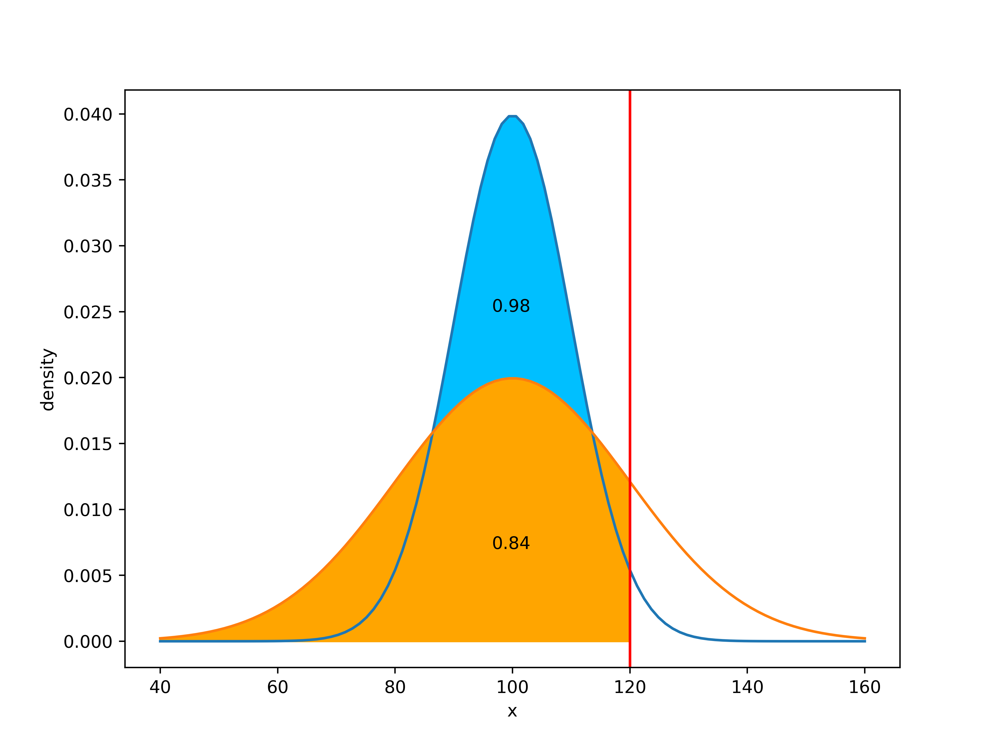
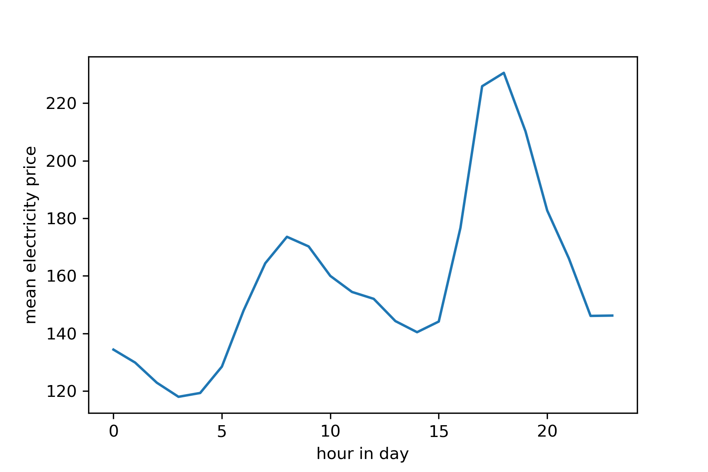
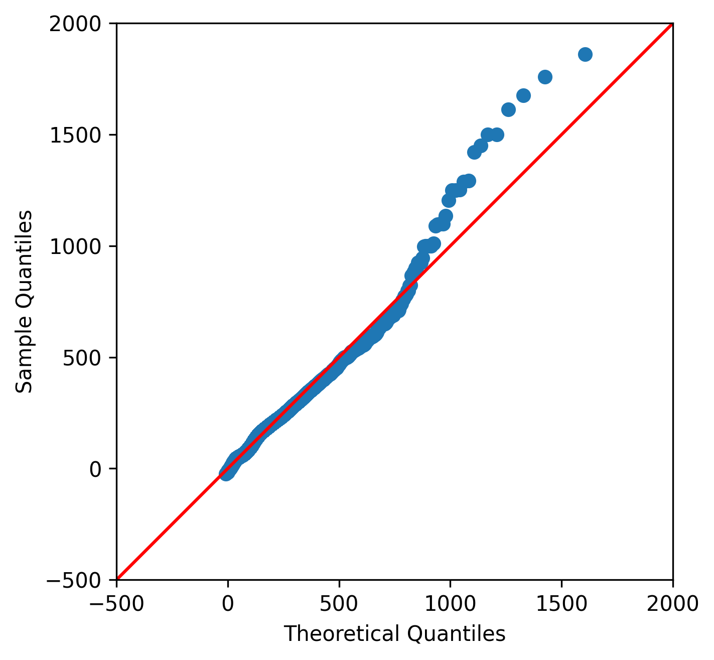
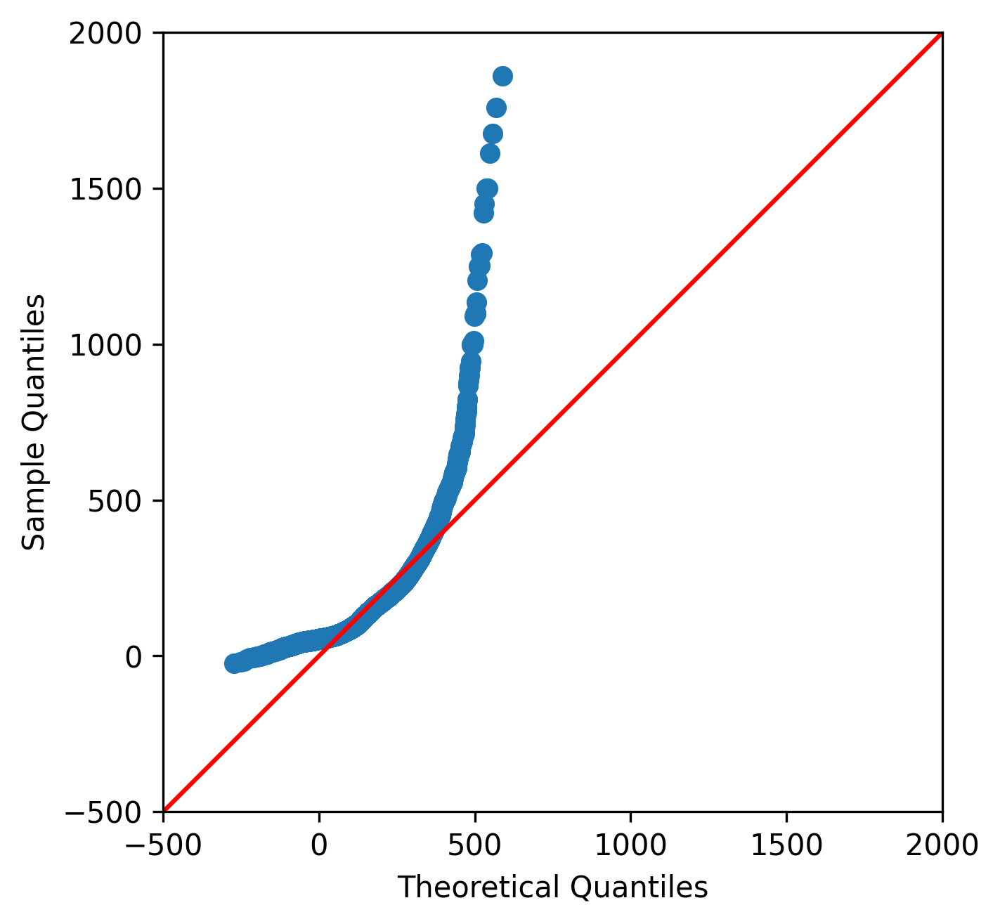

[](http://quantlet.de/)

## [](http://quantlet.de/) **MPF-Electricity_Distribution** [](http://quantlet.de/)

```yaml

Name of Quantlet:    'MPF-Electricity_Distribution'

Published in:        'Multivariate probabilistic forecasting of electricity prices with trading applications'

Description:         'This Quantlet visualises an empirical distribution of three electricity prices: day ahead auctions NordPool and EPEX, and system prices. The code reproduces Figures 2, 3, 5 and 6 of the manuscript. Data is not provided due to NDA.'

Keywords:            'qq-plot, empirical distribution, electricity, JohnsonSU, normal distribution, histogram'

Author:              Ilyas Agakishiev, Karel Kozmík


```









### [IPYNB Code: MPF-Electricity_Distribution.ipynb](MPF-Electricity_Distribution.ipynb)


automatically created on 2023-07-22