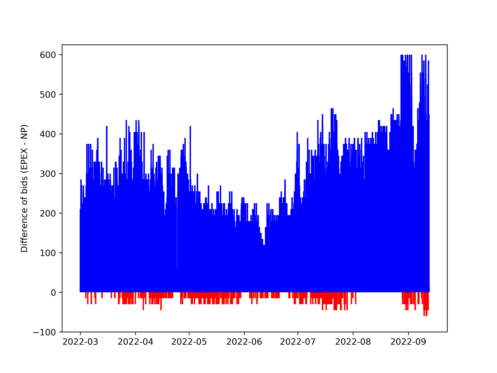
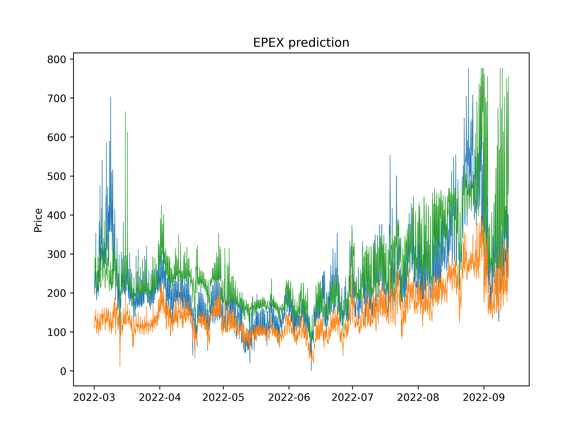
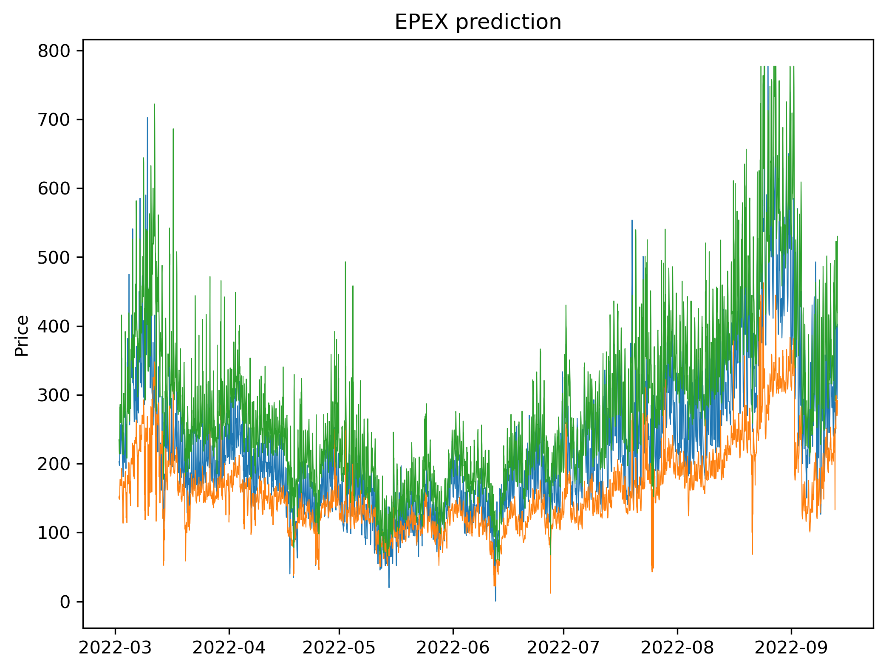

[](http://quantlet.de/)

## [](http://quantlet.de/) **MPF-Electricity_TradingSimEval** [](http://quantlet.de/)

```yaml

Name of Quantlet:    'MPF-Electricity_TradingSimEval'

Published in:        'Multivariate probabilistic forecasting of electricity prices with trading applications'

Description:         'This Quantlet generates simulations based on probabilistic predictions for DMLP, LASSO QR and the benchmark. Those are used for a sample trading strategy. Data is not provided due to NDA.'

Keywords:            'Monte-Carlo simulation, trading, empirical distribution, electricity, JohnsonSU'

Author:              Ilyas Agakishiev, Karel Kozmík


```










### [IPYNB Code: MPF-Electricity_TradingSimEval.ipynb](MPF-Electricity_TradingSimEval.ipynb)


automatically created on 2023-07-22